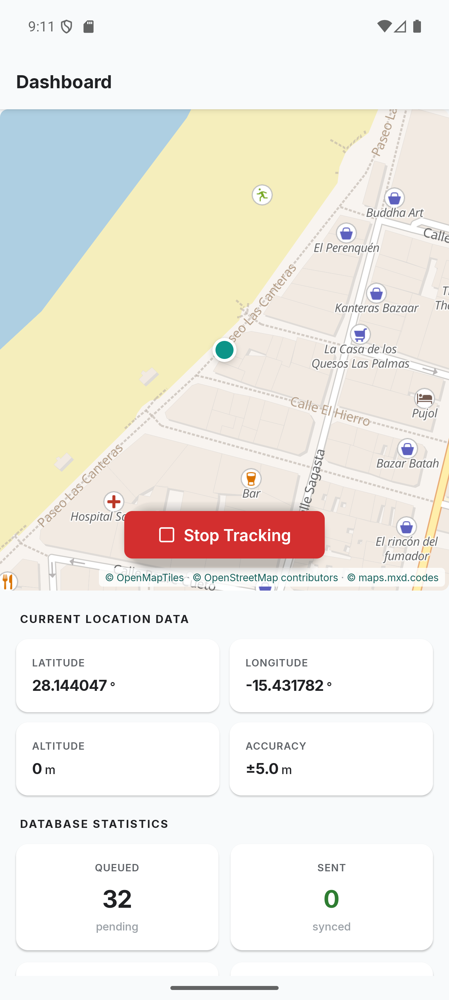
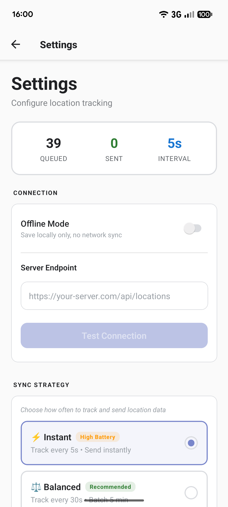
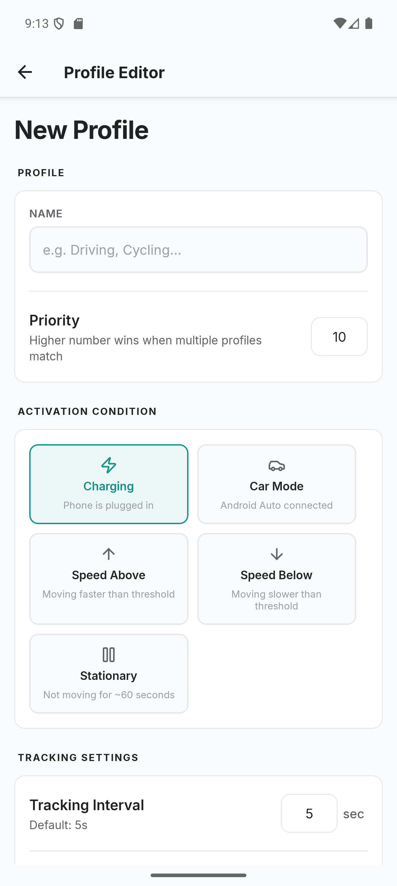
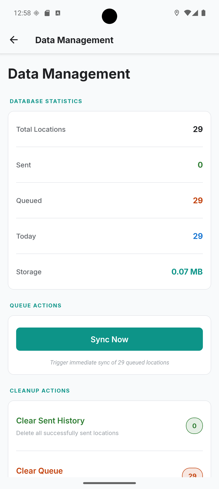

# Colota

[](https://www.gnu.org/licenses/agpl-3.0)  [](https://github.com/dietrichmax/colota/actions/workflows/lint-test.yml) [](https://github.com/dietrichmax/colota/actions/workflows/build-check.yml) [](https://developer.android.com) [](https://reactnative.dev) [](https://www.typescriptlang.org/)

**Self-hosted GPS tracking app for Android.**

Colota sends your location to your own server over HTTP(S). It works offline, supports geofencing, and doesn't share any data except with your backend.

[Google Play](https://play.google.com/store/apps/details?id=com.Colota&hl=en-US) | [F-Droid](https://f-droid.org/packages/com.Colota/) | [Documentation](https://colota.app/docs/introduction) | [Privacy Policy](https://colota.app/privacy-policy)

## Features

- **Self-Hosted** - Send location data to your own server. Works with Dawarich, OwnTracks, PhoneTrack, Reitti, Traccar, or any custom backend.
- **Privacy First** - No analytics, no telemetry, no third-party SDKs. Open source (AGPL-3.0).
- **Works Offline** - Fully functional without a server. Export as CSV, GeoJSON, GPX, or KML.
- **Reliable Tracking** - Foreground service, auto-start on boot, exponential backoff retry.
- **Geofencing** - Pause zones that automatically stop recording locations.
- **Tracking Profiles** - Automatically adjust GPS interval, distance filter, and sync settings based on conditions like charging, car mode, or speed.
- **Flexible Sync** - Instant, batch, Wi-Fi only, or offline modes.
- **Quick Setup** - Configure devices via `colota://setup` deep links or QR codes.
- **Authentication** - Basic Auth, Bearer Token, or custom headers with AES-256-GCM encryption.

## Screenshots

<table>
  <tr>
    <td></td>
    <td></td>
    <td></td>
    <td></td>
  </tr>
  <tr>
    <td align="center">Dashboard</td>
    <td align="center">Settings</td>
    <td align="center">Geofences</td>
    <td align="center">Data Management</td>
  </tr>
</table>

## Quick Start

```bash
# Install from Google Play, F-Droid, or download APK from Releases
# Then:
1. Grant location permissions (precise, all the time)
2. Disable battery optimization for Colota
3. Press Start Tracking
```

For full setup, server configuration, and integration guides, see the [documentation](https://colota.app).

## Documentation

Full docs at **[colota.app](https://colota.app)** covers configuration, server integration (Dawarich, OwnTracks, PhoneTrack, Reitti, Traccar, and custom backends), geofencing, data export, API reference, battery optimization, troubleshooting, and development setup.

## Build from Source

> **Requirements:** Node.js >= 20, Android SDK, JDK 17+

```bash
git clone https://github.com/dietrichmax/colota.git
cd colota
npm install
cd apps/mobile/android
./gradlew assembleGmsRelease    # Google Play variant
./gradlew assembleFossRelease   # F-Droid variant (no Google Play Services)
```

## Contributing

See the [Contributing Guide](https://colota.app/docs/contributing) for details on reporting issues, submitting pull requests, and code style.

## License

[AGPL-3.0](LICENSE) - Copyright (C) 2026 Max Dietrich

## Support

- [GitHub Issues](https://github.com/dietrichmax/colota/issues)
- [GitHub Discussions](https://github.com/dietrichmax/colota/discussions)
- [GitHub Sponsors](https://github.com/sponsors/dietrichmax)
- [Ko-fi](https://ko-fi.com/maxdietrich)
