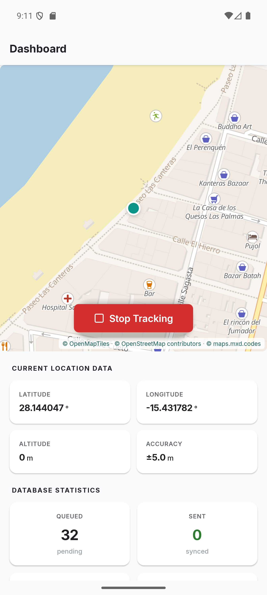
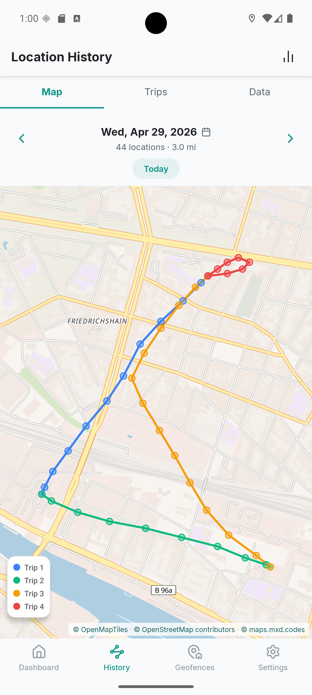
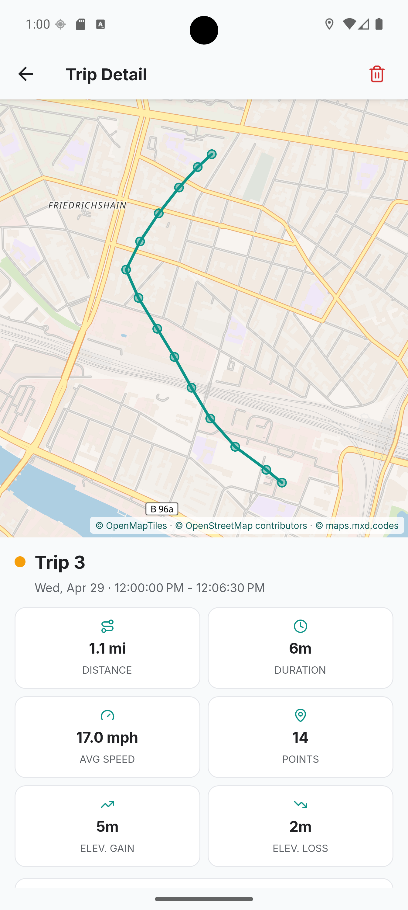
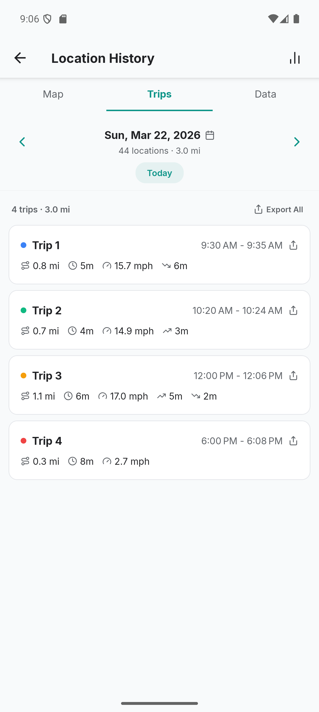
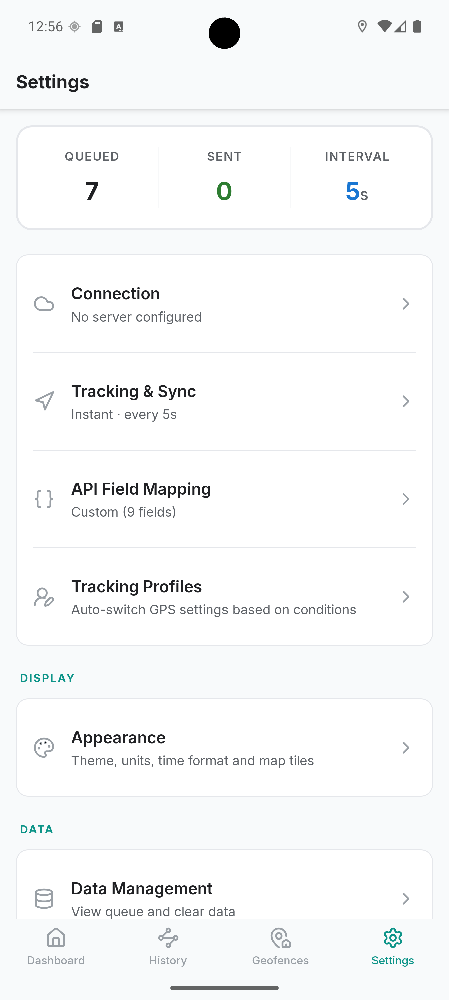
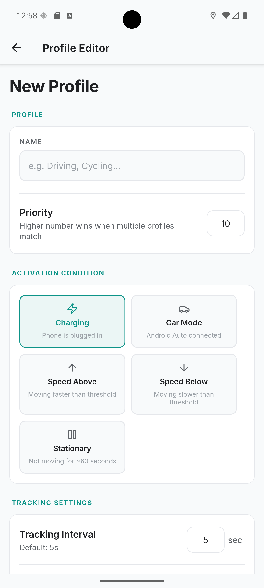
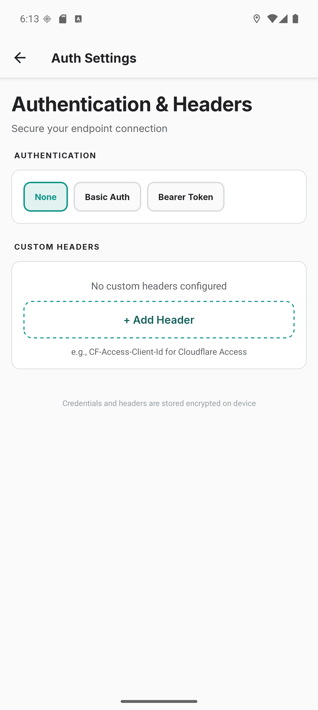
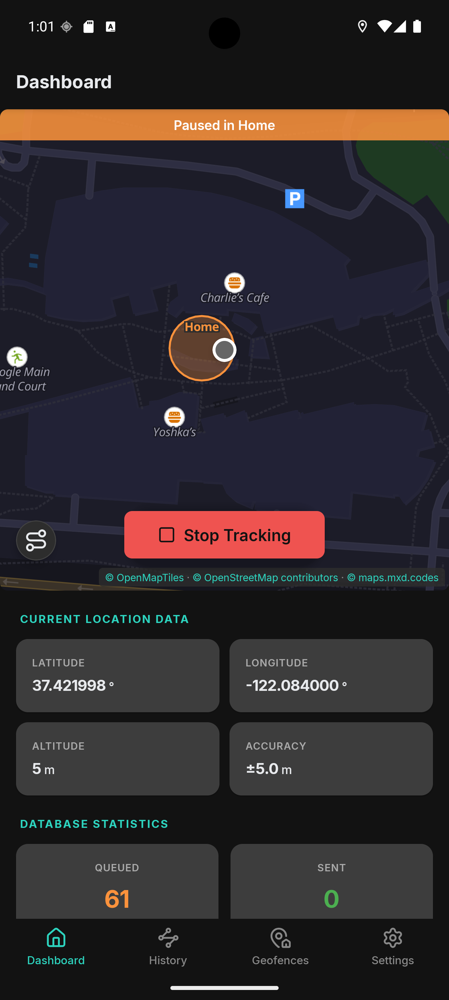

<p align="center">
  
</p>

# Colota - GPS Location Tracker

[](https://github.com/dietrichmax/colota/releases) [](https://www.gnu.org/licenses/agpl-3.0) [](https://play.google.com/store/apps/details?id=com.Colota&hl=en-US) [](https://apt.izzysoft.de/fdroid/index/apk/com.Colota)

**Self-hosted GPS tracking app for Android.**

Colota sends your location to your own server over HTTP(S). It works offline, supports geofencing, and has no analytics or telemetry.

[Documentation](https://colota.app/docs/introduction) | [Privacy Policy](https://colota.app/privacy-policy)

## Features

- **Self-Hosted** - Send location data to your own server. Works with Dawarich, GeoPulse, OwnTracks, PhoneTrack, Reitti, Traccar, Home Assistant or any custom backend.
- **Privacy First** - No analytics, no telemetry, no third-party SDKs. Open source (AGPL-3.0).
- **Works Offline** - Fully functional without a server. Export as CSV, GeoJSON, GPX or KML.
- **Offline Maps** - Download map areas to your device for use without an internet connection.
- **Scheduled Export** - Automatic daily, weekly or monthly exports to a local directory with file retention management.
- **Location History** - View daily summaries, trip segmentation, calendar with activity dots and per-trip export.
- **Reliable Tracking** - Foreground service, auto-start on boot and exponential backoff retry.
- **Geofencing** - Pause zones that automatically stop recording locations.
- **Tracking Profiles** - Automatically adjust GPS interval, distance filter and sync settings based on conditions like charging, car mode or speed.
- **Flexible Sync** - Instant, batch, Wi-Fi only or offline modes.
- **Display Settings** - Choose between metric and imperial units, 12h or 24h time format. Auto-detected from device locale on first use.
- **App Shortcuts** - Long-press the app icon to start or stop tracking directly from the home screen, compatible with automation apps like Tasker and Samsung Routines.
- **Quick Setup** - Configure devices via `colota://setup` deep links or QR codes.
- **Authentication** - Basic Auth, Bearer Token or custom headers with AES-256-GCM encryption.
- **Dark Mode** - Full light and dark theme support.

## Screenshots

<table>
  <tr>
    <td></td>
    <td></td>
    <td></td>
    <td></td>
  </tr>
  <tr>
    <td align="center">Dashboard</td>
    <td align="center">Location History (Map)</td>
    <td align="center">Trip Details</td>
    <td align="center">Trips</td>
  </tr>
</table>

<table>
  <tr>
    <td></td>
    <td></td>
    <td></td>
    <td></td>
  </tr>
  <tr>
    <td align="center">Settings</td>
    <td align="center">TrackingProfiles</td>
    <td align="center">Authentication</td>
    <td align="center">Dark Mode</td>
  </tr>
</table>

## Quick Start

1. Install from [Google Play](https://play.google.com/store/apps/details?id=com.Colota&hl=en-US) or download the APK from [GitHub Releases](https://github.com/dietrichmax/colota/releases)
2. Grant location permissions (precise, all the time)
3. Disable battery optimization for Colota
4. Press **Start Tracking**

For full setup, server configuration, and integration guides, see the [documentation](https://colota.app).

## Documentation

Full docs at **[colota.app](https://colota.app)** covers configuration, server integration (GeoPulse, Dawarich, OwnTracks, PhoneTrack, Reitti, Traccar, Home Assistant, and custom backends), geofencing, data export, API reference, battery optimization, troubleshooting, and development setup.

## Build from Source

> **Requirements:** Node.js >= 22, Android SDK, JDK 17+

```bash
git clone https://github.com/dietrichmax/colota.git
cd colota
npm ci
npm run build -w @colota/shared
cd apps/mobile/android
./gradlew assembleGmsRelease    # Google Play variant
./gradlew assembleFossRelease   # F-Droid variant (no Google Play Services)
```

## Contributing

See the [Contributing Guide](https://colota.app/docs/contributing) for details on reporting issues, submitting pull requests, and code style.

## License

[AGPL-3.0](LICENSE) - Copyright (C) 2026 Max Dietrich

## Support

- [GitHub Issues](https://github.com/dietrichmax/colota/issues)
- [GitHub Discussions](https://github.com/dietrichmax/colota/discussions)
